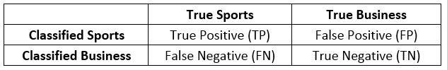
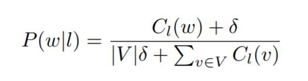
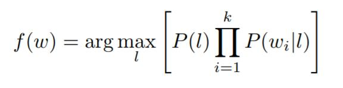
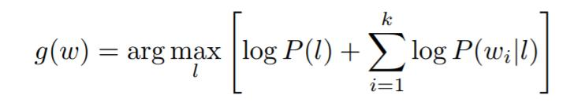

# News-Article-Classification
This project implements a general Naïve Bayes classifier for categorizing news articles as either SPORTS or BUSINESS (i.e., not SPORTS). The dataset consists of news articles (http://mlg.ucd.ie/datasets/bbc.html) from a BBC news dataset that have been labeled as either SPORTS or BUSINESS, which has been split into a training set and a testing set. If you open the files, you will see that the first word in each line is the class label and the remainder of the line is the news article.

## Methods to Implement
The code will open a file, parse it, pass it to the classifier, and output the results.
In the file NaiveBayesClassifierImpl.java, there are several important methods:
```Java
• void train(Instance[] trainingData, int v)
```
This method trains the classifier using the given training data. The integer argument `v` is the size of the total vocabulary in the model. It will be needed to compute the smoothed class-conditional probabilities. (See the section on Smoothing below.)
```Java
• void documents_per_label_count(Instance[] trainingData)
```
This method counts the number of documents per class label in the training set. The format of the printout is one line for each class label.
```Java
• void words_per_label_count(Instance[] trainingData)
```
This method counts the number of words per label in the training set. The format of the printout is one line for each label.
```Java
• double p_l(Label label)
```
This method returns the prior probability of the label in the training set. In other words, return `P(SPORTS) if label == Label.SPORTS` or `P(BUSINESS) if label == Label.BUSINESS`
```Java
• double p_w_given_l(String word, Label label) 
```
This method returns the conditional probability of `word` given `label`. That is, return `P(_word_|_label_)`. It uses smoothing to compute this probability.
```Java
• ClassifyResult classify(String[] words)
```
This method returns the classification result for a single news article.
```Java
• public ConfusionMatrix calculateConfusionMatrix(Instance[] testData)
```
This method takes a set of test instances and calculates a confusion matrix. The return type is `ConfusionMatrix`. The member variables of that class should be self-explanatory. The following table explains the different cells of the confusion matrix:

<div align= "center">

</div>
		
The program also defined four class types to assist implementation. The `Instance` class is a data structure holding the label and the news article as an array of words:
```Java
public class Instance {
    public Label label;
    public String[] words;
}
```
The `Label` class is an enumeration of our class labels:
```Java
public enum Label { SPORTS, BUSINESS }
```
The `ClassifyResult` class is a data structure holding a label and two log probabilities (whose values are described in the log probabilities section below):
```Java
public class ClassifyResult { 
    public Label label; 
    public double log_prob_sports; 
    public double log_prob_business; 
}
```
The `ConfusionMatrix` class is a data structure to be instantiated in the `calculateConfusionMatrix` method with True Positive(TP), False Positive(FP), False Negative(FN) and True Negative(TN) numbers for the classification task on the test data:
```Java
public class ConfusionMatrix { int TP, FP, FN, TN; }
```

## Smoothing
There are two concepts the program uses here

• _Word token_: an occurrence of a given word

• _Word type_: a unique word as a dictionary entry

For example, “the dog chases the cat” has 5 word tokens but 4 word types; there are two tokens of the word type “the.” Thus, when we say a word “token” in the discussion below, we mean the number of words that occur and _NOT_ the number of unique words. As another example, if a news article is 15 words long, we would say that there are 15 word tokens. For example, if the word “lol” appeared 5 times, we say there were 5 tokens of the word type “lol.”

The conditional probability P(_w_|_l_), where _w_ represents some word token and _l_ is a label, is a multinomial random variable. If there are |_V_| possible word types that might occur, imagine a |_V_|-sided die. P(_w_|_l_) is the likelihood that this die lands with the _w_-side up. The program estimates two such distributions: P(_w_|_Sports_) and P(_w_|_Business_).

One might consider estimating the value of P(_w_|_Sports_) by simply counting the number of _w_ tokens and dividing by the total number of word tokens in all news articles in the training set labeled as _Sports_, but this method is not good in general because of the “unseen event problem,” i.e., the possible presence of events in the test data that did _not_ occur at all in the training data. For example, in our classification task consider the word “foo.” Say “foo” does _not_ appear in our training data but _does_ occur in our test data. What probability would our classifier assign to P(_foo_|_Sports_) and P(_foo_|_Business_)? The probability would be 0, and because we are taking the sum of the logs of the conditional probabilities for each word and log 0 is undefined, the expression whose maximum we are computing would be undefined. This wouldn’t be a good classifier.

What we do to get around this is we pretend we actually _did_ see some (possibly fractionally many) tokens of the word type “foo.” This goes by the name Laplace smoothing or add-δ smoothing, where δ is a parameter. We write:
<div align= "center">

</div>

where _l_ ∈ {_Sports_, _Business_}, and _Cl_(_w_) is the number of times the token _w_ appears in news articles labeled _l_ in the training set. As above, |_V_| is the size of the total vocabulary we assume we will encounter (i.e., the dictionary size). Thus it forms a superset of the words used in the training and test sets. The value |_V_| will be passed to the train method of the classifier as the argument `int v`. This project uses the value δ = 0.00001.

## Log Probabilities 
The second gotcha that any implementation of a Naive Bayes classifier must contend with is underflow. Underflow can occur when we take the product of a number of very small floating-point values. Fortunately, there is a workaround. Recall that a Naive Bayes classifier computes
<div align= "center">

</div>

where _l_ ∈ {_Sports_, _Business_} and _wi_ is the _i_ th word token in a news article, numbered 1 to _k_. Because maximizing a formula is equivalent to maximizing the log value of that formula, _f_(_w_) computes the same class as
<div align= "center">

</div>

What this means is that the program should compute the _g_(_w_) formulation of the function above rather than the _f_(_w_) formulation. Methods `p_l` and `p_w_given_l` return the true probabilities themselves and __NOT__ the logs of the probabilities.

`ClassifyResult` class returns: `log_prob_sports` is the value log𝑃(𝑙) + Σ(𝑖=1→𝑘)log𝑃(𝑤𝑖|𝑙) with _l_ = _Sports_ and `log_prob_business` is the value with _l_ = _Business_. The label returned in this class corresponds to the output of _g_(_w_). Break ties by classifying an instance as _Sports_.

## Testing
The format of testing commands:

    java NewsClassifier <modeFlag> <trainFilename> <testFilename>

where `trainingFilename` and `testFilename` are the names of the training and testing dataset files, respectively. `modeFlag` is an integer from 0 to 3, controlling what the program will output:

    0. Prints the number of documents for each label in the training set 
    1. Prints the number of words for each label in the training set 
    2. For each instance in test set, prints a line displaying the predicted class and the log probabilities for both classes 
    3. Prints the confusion matrix 
Sample input files and their corresponding output files for each mode are `train.bbc.txt` and `test.bbc.txt` in `Test Cases`. So, here is an example command:

    java NewsClassifier <modeFlag> train.bbc.txt test.bbc.txt
